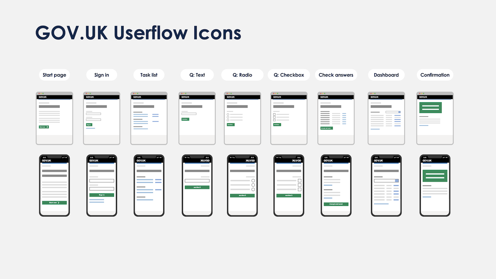

# GOV.UK Userflow Icons

High resolution vector (SVG) icons to help you create user flow diagrams. This repository includes:

- Mobile and desktop icons
- Example PowerPoint template



## Introduction

User flow diagrams are a useful tool to map out what users see when navigating through a digital service. GOV.UK services use a common set of page patterns, so a small set of common page types can be used to map out a wide variety of service journeys. 

This repository provides a set of high-res icons for use when mapping out GOV.UK user flows.

If you use Sketch, you might prefer [govuk-design-system-flow-diagrams](https://github.com/dashouse/govuk-design-system-flow-diagrams) or [gov-flow](https://github.com/charlesrt/gov-flow)

## Usage

##### Option 1: 🎨 Use your favourite graphics tool (e.g Sketch or Miro)

- Download the contents of the repository
- Drag and drop the relevant .svg files into your graphics application (provided that it supports .svg imports)

##### Option 2: 👩‍🏫 Use PowerPoint

- Download the ```template-powerpoint.pptx``` file from the ```templates``` folder
- Open the template in PowerPoint

## Credit

Thanks to [dashouse/govuk-design-system-flow-diagrams](https://github.com/dashouse/govuk-design-system-flow-diagrams) and [charlesrt/gov-flow](https://github.com/charlesrt/gov-flow) for inspiration. Go and check them out 🌟